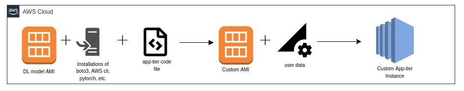
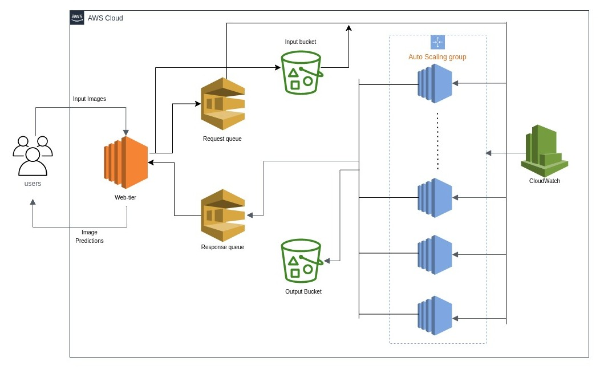

# Image Recognition using an IaaS-based application

## Group Members
- Prasidh Aggarwal (paggar10)
- Revanth (rbangal5)
- Shriya (ssrin103)

## Tasks
### Prasidh Aggarwal
Chiefly responsible for coding the web tier part of the application. It included developing a java application that does five main functions:
- Upload the images to the request S3 bucket
- Send the messages with file names as the message body to the SQS request queues
- Continuously poll the response SQS queue for messages with message body as “file-name, classification-result,”
- Delete the messages which have been polled from the SQS response queue
- Finally, return the output to the workload generator along the lines of which image was uploaded and what was the image classification result for that image.

Also responsible for deploying the web-tier application on an EC2 instance, ensuring it has appropriate roles and permissions to do the required operations, and testing it via the workload generator locally as well as on AWS.


### Shriya
Main responsibilities included coding the app tier part of the ecosystem. Work included developing a python application that does seven main functions:
- Poll the SQS request queue continuously to look for any new messages
- Use the request messages to download the respective images from the request S3 bucket
- Download the images locally
- Perform image classification on them using the model provided
- Delete the message from the request SQS queue
- Send the response message with “file-name, classification-result” in the message body to the response SQS queue
- Upload the image with the classification result to the response S3 bucket.

### Revanth
Main responsibilities included setting up all AWS resources as listed:
- IAM: users, groups, roles, policies, account aliases.
- S3: Request bucket, Response bucket.
- SQS: Request queue, Response queue.
- AMI: Custom AMI with image classification model.
- Auto Scaling Group, including launch Configuration with user data to automate the installations of different modules on app tiers and run the app.py files.
- Auto Scaling policies: Scaling in and Scaling out.
- Cloud Watch alarms: Alarm for Scaling in, Alarm for Scaling out.

Apart from these individual tasks, every team member was involved in designing, implementing, developing, and testing the application.

## Architecture





## AWS Credentials
AWS credentials are provided through an ec2-user role through IAM to the app tier. For the web tier application, they are provided through a parameter (/project-1/credentials) in the parameter store of the Systems manager.
Considering it is not a good practice to ever expose AWS credentials, they are not mentioned here.

## PEM Key 
Please click [here](https://github.com/prasidh-agg/Image-Recognition-IaaS/tree/main/extras/configs/web-tier.pem) to access the PEM key for web-tier SSH access.

## Web Tier’s URL
http://54.157.162.125:8080/file-upload

## SQS Queue Names
- cse546-p1-request 
- cse546-p1-response

## S3 Bucket Names
- cse546.p1.requests
- cse546.p1.responses

## Other AWS resources
- AutoScaling group --> cse546-asg-v2
- Step policies  --> step-scaling-out-cse546, step-scaling-in-cse546
- CloudWatch Alarms --> Scaling-out-cse546, Scaling-in-cse546-alarm
- Custom AMI for app-tier --> ami-0b3d7c692204c4990

## Project working and Architecture
Please click [here](https://github.com/prasidh-agg/Image-Recognition-IaaS/tree/main/reports/ServerlessPresso_Group_Report.pdf) to read a detailed report of the working of the application.
For individual member reports use the below links:
-[Prasidh](https://github.com/prasidh-agg/Image-Recognition-IaaS/tree/main/reports/Prasidh_Aggarwal_Individual_Report.pdf)
-[Shriya](https://github.com/prasidh-agg/Image-Recognition-IaaS/tree/main/reports/Shriya_Srinivasan_Individual_Report.pdf)
-[Revanth](https://github.com/prasidh-agg/Image-Recognition-IaaS/tree/main/reports/Revanth_Suresha_Individual_Report.pdf)

## How to get started?
1. Clone the repo.
2. Build the java project and get the jar file.
3. Using scp and the .pem file, upload the jar file to an EC2 instance (Any ubuntu instance with Java JDK 1.8).
 ``` scp -i /path/to/.pem/file /path/to/jar/file ubuntu@ec2-<public-ip>.compute-1.amazonaws.com:~/```
 
4. Connect to the web tier via ssh or EC2 Instance connect.
5. Run the web_tier using java -jar <name-of-jar-file>
6. From the workload generator directory, run ``` python3 multithread_workload_generator.py --num_request 100 --url 'http://<public-ip>:8080/file-upload' --image_folder "/path/of/images"```
7. You can see the logs in the web_tier.
8. After initial scale up, you would be able to responses in both the web_tier logs and the output of the workload generator.
